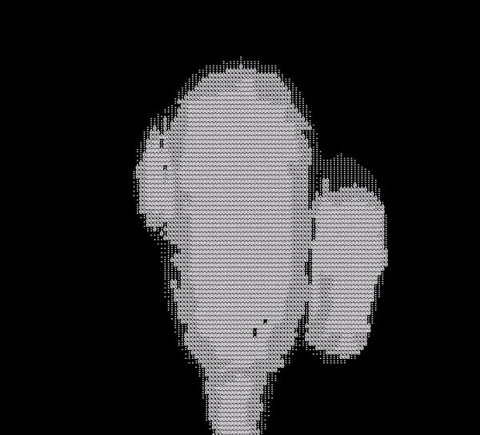

# 3D ASCII model

# Instructions for setting up

First clone the repository by `git clone https://github.com/MuhenderRaj/3d-with-ascii.git`.

## Typescript version

Open the Typescript folder by `cd Typescript`.

Run `npm run watchify-client` to start the client auto-compilation.

Run `npm run start-server` to start the server.

Navigate to `localhost:3000` on a browser to see the result.

## Python version 

Open the Python folder by `cd Python`.

Then, run `main.py` for a sample program.

To define your own scripts, follow the template in `template_script.py` and import it in `main_engine.py`.
After this, run `main_engine.py`.

The output is written to `output.txt` and updated every 0.5 seconds. 

To stop the program, use Ctrl/Cmd - C